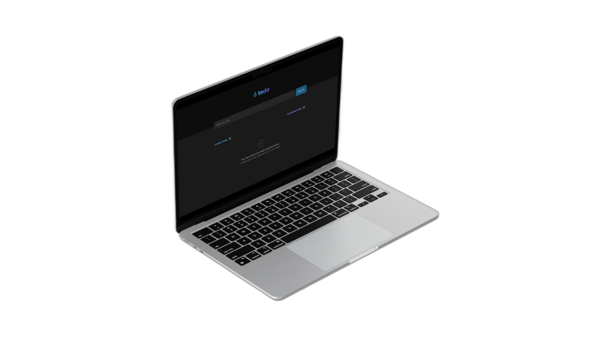
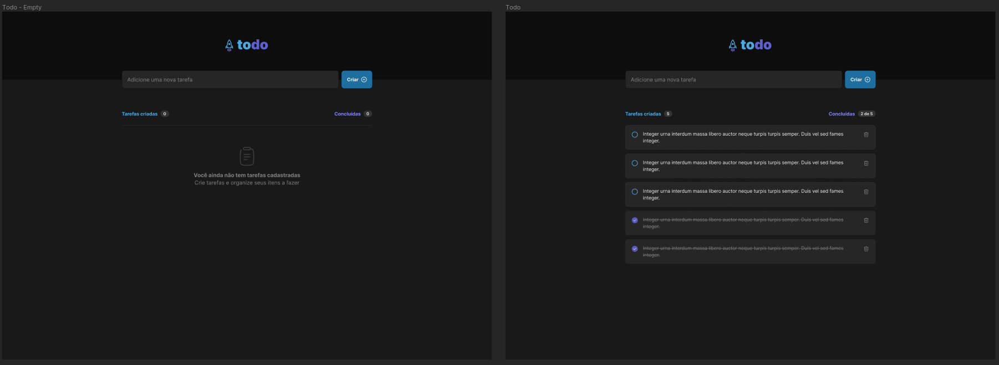
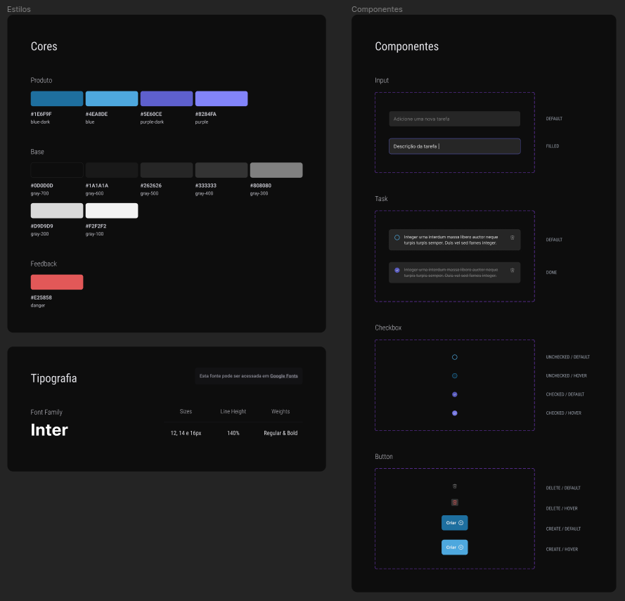

<h3 align="center">
    
</h3>

<h1 align="center"># To-Do List Challenge</h1>

<p align="center">
<a href="#project"></a>&nbsp;
<a href="#layout"></a>&nbsp;
<a href="#environment"></a>&nbsp;
<a href="#license"></a>&nbsp;
</p>

<h3 align="center">
  
</h3>

## Project

This project was developed to meet the challenge of creating a to-do list with the following functionalities:

- Add a new task
- Mark and unmark a task as completed
- Remove a task from the list
- Show the progress of task completion

Despite the simplicity of these functionalities, the project provided an opportunity to reinforce concepts such as:

- State management
- Immutability of state
- Lists and keys in ReactJS
- Properties
- Componentization

### Demo:

<p align="center">

</p>

> `Alert 1:` For optimal experience, it is advisable not to use IE 6-8 as a browser due to certain styling features.

## Layout

For this challenge, it was necessary to meticulously replicate a design created in Figma. You can view screenshots of the Figma design here:

<p align="center">
  
  
</p>

## Environment

Make sure you have the following installations:

- [Git](https://git-scm.com/)
- [Node](https://nodejs.org/en)
- [Npm](https://www.npmjs.com/)

### Setup Instructions:

1. Clone the repository:
   ```bash
     https://github.com/CaioLemec/challenge-todoList.git
   ```
2. Install all dependencies by running:
   ```bash
   npm i
   ```
3. Start the application in <strong>dev</strong> mode:
   ```bash
   npm run dev
   ```

---

## License

Licensed under MIT. Learn more in the [LICENSE](/LICENSE) file.

---

## Contact

Feel free to reach out for clarifications or feedback.


<em align="center">Caio Lemec</em>

[](mailto:caiolemec@gmail.com)
[](https://www.linkedin.com/in/caiolemec/)
